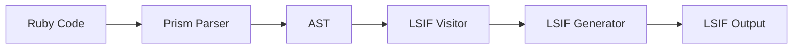
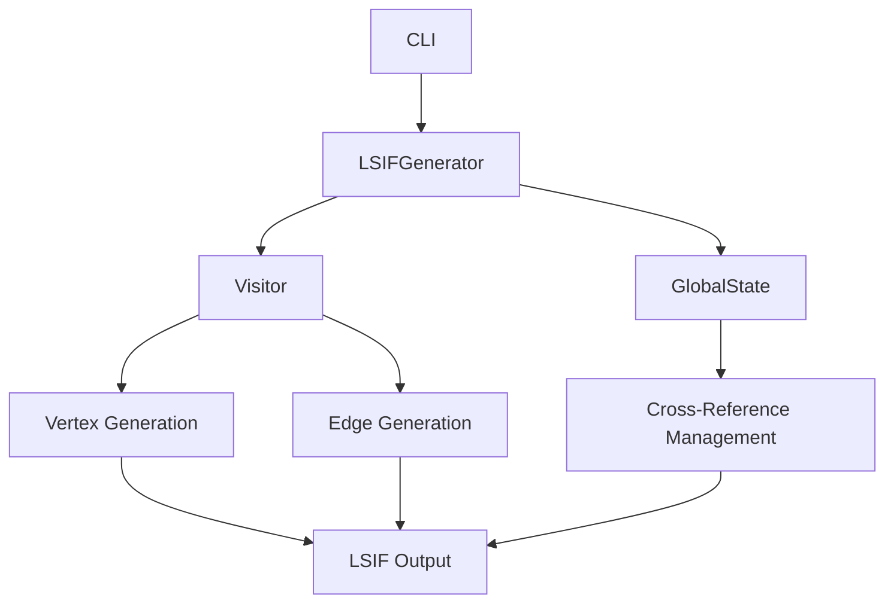
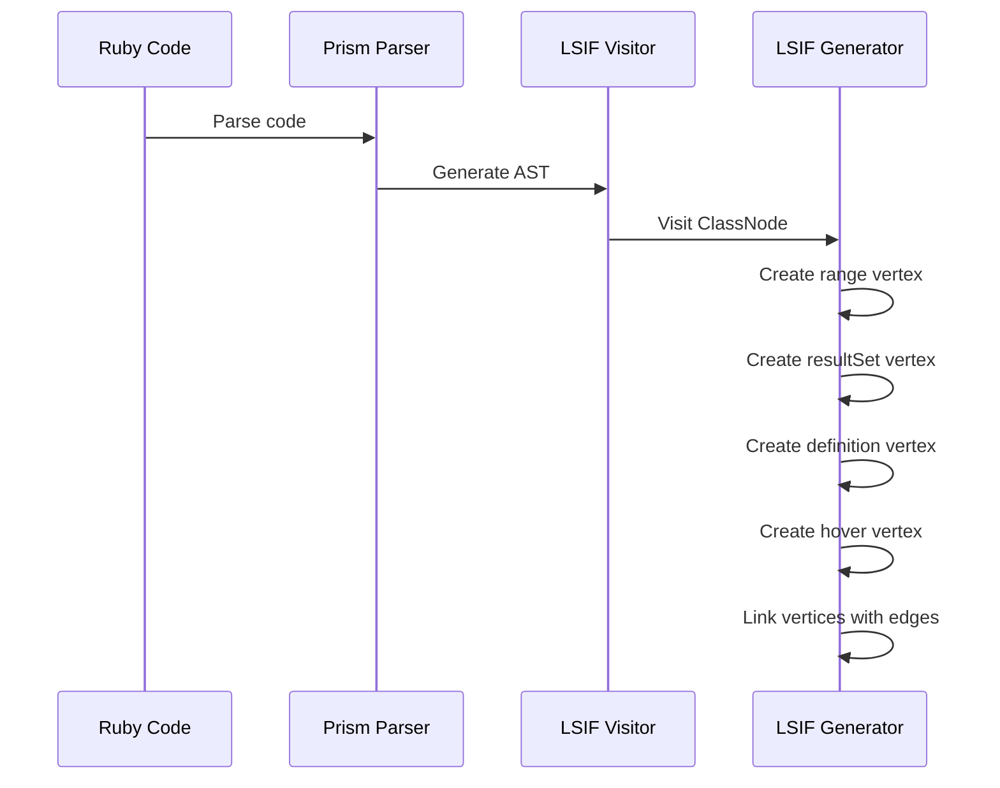
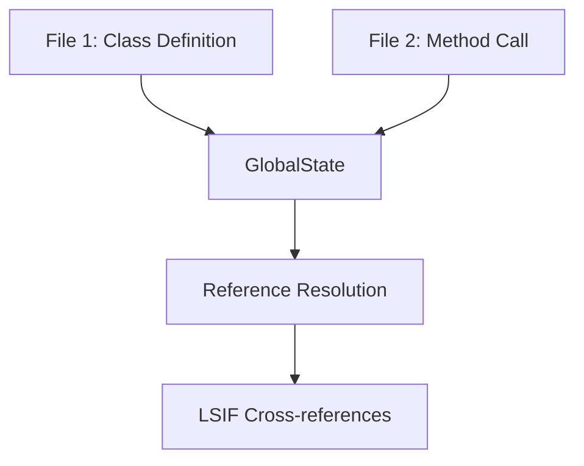

# Understanding LSIF Generation in Hind

This document explains how Hind generates LSIF (Language Server Index Format) data from Ruby source code using Prism for parsing and analysis.

## Table of Contents
- [Overview](#overview)
- [LSIF Format](#lsif-format)
- [Architecture](#architecture)
- [Prism Integration](#prism-integration)
- [AST to LSIF Conversion](#ast-to-lsif-conversion)
- [Handling Cross-References](#handling-cross-references)
- [Examples](#examples)

## Overview

LSIF is a file format that captures code intelligence data for providing features like:
- Go to definition
- Find references
- Hover documentation
- Symbol search

Hind generates this data through a three-step process:
1. Parse Ruby code using Prism to create an AST
2. Visit AST nodes to extract code intelligence information
3. Convert this information into LSIF format

Here's a high-level view of the process:



## LSIF Format

LSIF uses a graph structure with:
- Vertices: Represent elements (documents, ranges, results)
- Edges: Represent relationships between elements

Basic structure:
```json
// Vertex
{
  "id": 1,
  "type": "vertex",
  "label": "document",
  "uri": "file:///path/to/file.rb"
}

// Edge
{
  "id": 2,
  "type": "edge",
  "label": "contains",
  "outV": 1,
  "inV": 3
}
```

## Architecture

Hind's LSIF generation architecture:



Key components:
- `LSIFGenerator`: Orchestrates the generation process
- `GlobalState`: Manages cross-file references and state
- `Visitor`: Traverses AST and generates LSIF data

## Prism Integration

Prism provides a rich AST representation of Ruby code. Here's how different node types are handled:

```ruby
# Ruby code
class MyClass
  def my_method(arg)
    puts arg
  end
end

# Corresponding node types
ClassNode
├── ConstantPathNode (class name)
└── DefNode (method)
    ├── Parameters
    └── CallNode (puts)
```

Node type mapping to LSIF:
- `ClassNode` → Definition + Hover
- `DefNode` → Definition + Hover + Parameters
- `CallNode` → Reference
- `ConstantReadNode` → Reference

## AST to LSIF Conversion

Example conversion process:



Example for a simple method definition:

```ruby
# Ruby code
def hello(name)
  puts "Hello, #{name}!"
end

# Generated LSIF (simplified)
{ id: 1, type: "vertex", label: "range", ... }
{ id: 2, type: "vertex", label: "resultSet" }
{ id: 3, type: "vertex", label: "definitionResult" }
{ id: 4, type: "vertex", label: "hoverResult", ... }
{ id: 5, type: "edge", label: "next", outV: 1, inV: 2 }
{ id: 6, type: "edge", label: "textDocument/definition", outV: 2, inV: 3 }
{ id: 7, type: "edge", label: "textDocument/hover", outV: 2, inV: 4 }
```

## Handling Cross-References

Cross-file references are managed through the GlobalState:



Example:
```ruby
# lib/my_class.rb
class MyClass
  def my_method; end
end

# lib/usage.rb
obj = MyClass.new
obj.my_method
```

The GlobalState tracks:
- Definitions (where symbols are defined)
- References (where symbols are used)
- Result sets (linking definitions and references)

## Examples

Here's a complete example showing how a Ruby class gets converted to LSIF:

```ruby
# Input Ruby code
class Person
  def initialize(name)
    @name = name
  end

  def greet
    puts "Hello, #{@name}!"
  end
end

# Generated LSIF structure
Document Vertex (file)
├── Contains Edge
│   └── Range Vertex (class)
│       ├── Next Edge
│       │   └── ResultSet Vertex
│       │       ├── Definition Edge
│       │       │   └── DefinitionResult Vertex
│       │       └── Hover Edge
│       │           └── HoverResult Vertex
│       └── Contains Edge
│           ├── Range Vertex (initialize)
│           │   └── [Similar structure]
│           └── Range Vertex (greet)
│               └── [Similar structure]
```

This structure enables:
- Finding all references to the Person class
- Navigating to method definitions
- Displaying hover documentation
- Understanding class structure
